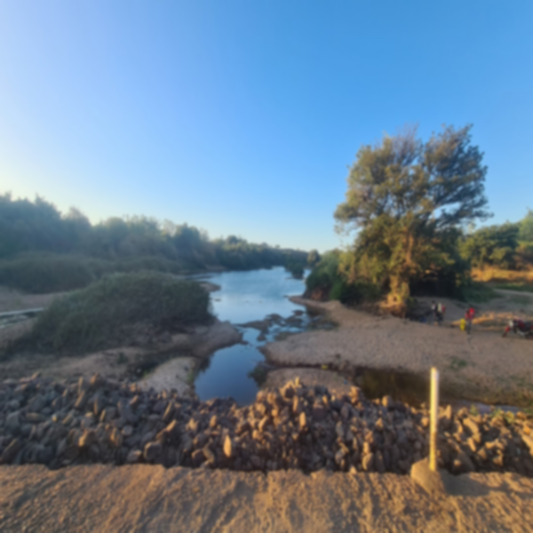
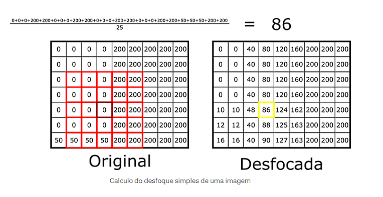
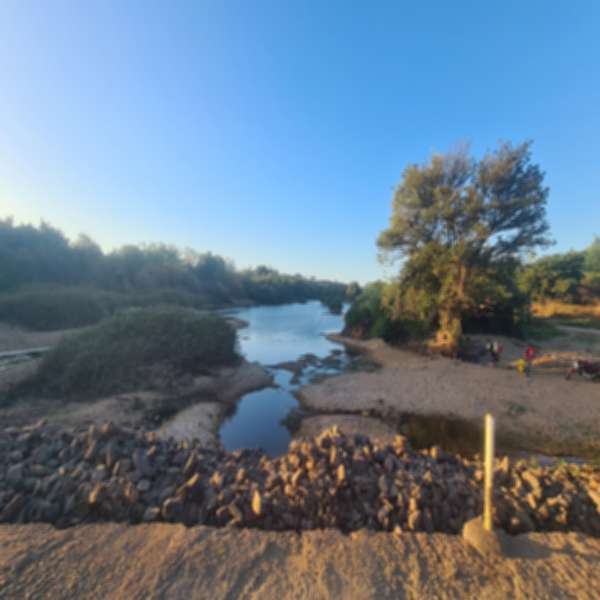
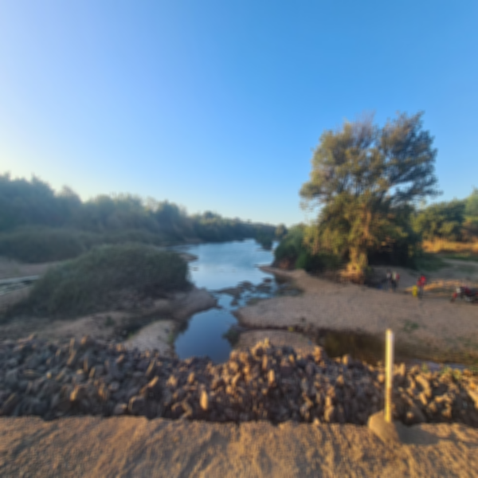
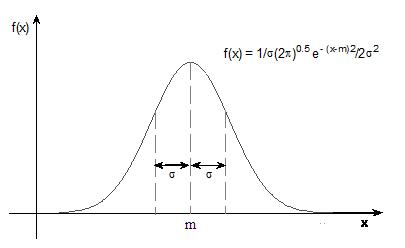
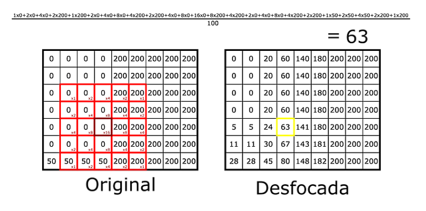
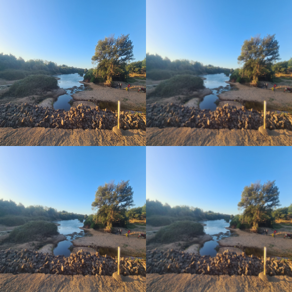

# Projeto de Manipulação de Imagens com Python

Este projeto explora diversas técnicas de manipulação de imagens utilizando Python. A primeira funcionalidade implementada é a aplicação de um filtro de desfoque (blur) utilizando a média dos pixels ao redor.

## Estrutura do Projeto

O projeto é organizado em duas partes principais:

1. **`image_blur_media.py`**: Contém a implementação da classe `ImageBlurMedia`, responsável por aplicar o desfoque em uma imagem utilizando a média dos pixels vizinhos.
2. **`main.py`**: Script que utiliza a classe `ImageBlurMedia` para aplicar o desfoque em imagens.

### Código do Filtro de Desfoque com Média

#### Imagem Original:

#### Imagem com o 1° Filtro de Blur e Redimensionamento

#### Imagem com o 2° Filtro de Blur


```python
from PIL import Image

class ImageBlur:
    def __init__(self, input_image_path, output_image_path):
        self.input_image_path = input_image_path
        self.output_image_path = output_image_path

    def apply_blur(self):
        imagem = Image.open(self.input_image_path)
        dimensao = (600, 600)
        imagem = imagem.resize(dimensao)
        imagem = imagem.convert('RGB')
        largura, altura = imagem.size

        imagem_blur = Image.new('RGB', (largura, altura))

        for x in range(largura):
            for y in range(altura):
                soma_r = 0
                soma_g = 0
                soma_b = 0
                contagem = 0

                for dx in range(-1, 2):
                    for dy in range(-1, 2):
                        nx = x + dx
                        ny = y + dy

                        if 0 <= nx < largura e 0 <= ny < altura:
                            pixel_valor = imagem.getpixel((nx, ny))
                            soma_r += pixel_valor[0]
                            soma_g += pixel_valor[1]
                            soma_b += pixel_valor[2]
                            contagem += 1

                media_r = soma_r // contagem
                media_g = soma_g // contagem
                media_b = soma_b // contagem
                imagem_blur.putpixel((x, y), (media_r, media_g, media_b))

            if x % 10 == 0:
                print(f"Processando coluna {x} de {largura}")

        imagem_blur.save(self.output_image_path)
        imagem_blur.show()
        print(f"Imagem processada e salva em {self.output_image_path}")

```

#### Explicação do Código

- **`__init__`**: Método construtor que inicializa os caminhos dos arquivos de entrada e saída.
- **`apply_blur`**: Método que aplica um desfoque na imagem usando a média dos pixels vizinhos. Cria uma nova imagem onde cada pixel é a média dos valores RGB dos pixels em uma janela **3x3** ao redor.



#### Justificativa para o Redimensionamento da Imagem

- **Por que redimensionar a imagem?**
    - Durante os testes, observei que o efeito de desfoque se tornava quase imperceptível na imagem original, que tinha uma resolução muito alta (1634x919 pixels). Devido ao grande número de pixels, o desfoque aplicado a cada pixel individual representava uma mudança mínima na imagem como um todo.
    - Ao redimensionar a imagem para (600x600) pixels, a proporção do desfoque em relação ao tamanho da imagem aumenta significativamente, tornando o efeito mais visível. Na imagem original, cada pixel modificado representava apenas 0,000067% da imagem total, enquanto na imagem redimensionada, cada pixel modificado representa 0,00028% da imagem, ou seja, o efeito de desfoque é aproximadamente 418% mais perceptível.
    - Ressalto que essa explicação é baseada em observações práticas e não em cálculos exatos, mas ilustra o motivo pelo qual o redimensionamento foi útil para tornar o efeito de blur mais evidente.

#### Testes com Diferentes Tamanhos de Janela

- **4x4**

- **5x5**

- **6x6**


- **Observação**: Ao aumentar o tamanho da janela de blur em editores de imagem, você notará que o efeito de desfoque se torna mais pronunciado. A pergunta que surge é se esses editores aumentam a janela ou reaplicam o blur várias vezes. Nos meus testes, foi mais eficiente aumentar a janela do que reaplicar o blur repetidamente.

Aqui está um exemplo de README detalhado explicando o código de implementação manual do filtro gaussiano e incluindo uma indicação de vídeo em português.

---

# Implementação Manual do Filtro Gaussiano
Antes de tudo essa implementação teve como base a do site MEDIUM, pelo Guilherme Salustino. Para quem tiver interessado a ver [Clique aqui](https://medium.com/turing-talks/implementa%C3%A7%C3%A3o-do-desfoque-gaussiano-d6e21e314920)

### Introdução:
**Primeiramente, o que é uma função gaussiana?**
* A função gaussiana, também conhecida como função normal ou curva de Gauss, é uma função matemática que descreve a distribuição de probabilidades de uma variável contínua. Ela é amplamente usada em estatística, probabilidade e processamento de imagem devido às suas propriedades matemáticas e ao fato de que muitas variáveis naturais seguem uma distribuição normal.


Em comparação com o Algoritmo de média, podemos melhorar um pouco nosso algoritmo, pode ser útil em vez de uma média aritmética conseguimos adicionar pesos a cada posição, para por exemplo as posições centrais importarem mais que as mais distantes.



Esses pesos são representados em uma matriz, chamada de núcleo de convolução (do inglês kernel), as vezes também chamada de máscara.
Brincando com os pesos e a quantidade de pixels considerados, podemos obter uma variedade de efeitos interessantes, como diferentes tipos de desfoque, detecção de bordas e até mesmo reconhecimento de rostos! Esses mesmos conceitos de matrizes de pesos são usados nas Redes Neurais Convolucionais (CNNs). Nessas redes, os pesos começam com valores aleatórios e são ajustados durante o treinamento para melhorar o desempenho do modelo.

#### Aplicação da Convolução:

```python
    def convolucao


```


## Função MergeFour
* Essa função vai servir para juntar 4 imagens diferentes em 1 imagem só, para fins de comparação
* No caso dos testes que eu utilizei, fiz a lógica travada em imagens de 300x300, formando uma imagem 600x600 ao final da função, no futuro eu posso melhorar isso e fazer com que o usuário escolha
```python
from PIL import Image

class MergeFour(): # passei mto tempo pensando nesse nome e ainda não gostei :(
    def __init__(self, path_foto_1, path_foto_2, path_foto_3, path_foto_4, output_image_path):
            
            # iniciando o path de todas as fotos
            self.path_foto_1 = path_foto_1
            self.path_foto_2 = path_foto_2
            self.path_foto_3 = path_foto_3
            self.path_foto_4 = path_foto_4
            self.output_image_path = output_image_path

    def Merge(self):

        dimensao = (300, 300) # dimensão das imagens
        # lista com tds as imagens (1 ao 4) e já redimensionadas 
        imagem = [(Image.open(self.path_foto_1)).resize(dimensao), 
                  (Image.open(self.path_foto_2)).resize(dimensao), 
                  (Image.open(self.path_foto_3)).resize(dimensao), 
                  (Image.open(self.path_foto_4)).resize(dimensao)]
        # nova imagem com a dimensao 600,600 por ser 4 fotos de 300,300
        imagem_compfour = Image.new('RGB', (600,600))  
        # usando o comando .paste para colar as imagens (pensei em fazer colocando pixel por pixel, mas ia dar um trampo mto desnecessario)
        imagem_compfour.paste(imagem[0], (0,0))
        imagem_compfour.paste(imagem[1], (0,300))
        imagem_compfour.paste(imagem[2], (300,0))
        imagem_compfour.paste(imagem[3], (300,300))


        imagem_compfour.save(self.output_image_path)
        imagem_compfour.show()
        print(f"Imagem processada e salva em {self.output_image_path}")

```
#### Exemplo de imagem:


## `main.py`

### Descrição

O arquivo `main.py` contém a função principal que utiliza a classe `ImageBlurMedia` para aplicar o filtro de desfoque por média em uma imagem e a classe `ImageBlurGauss` para aplicar o filtro de desfoque pela função Gaussiana em uma imagem.

### Código

```python
from image_blur import ImageBlur

def main():
    # Aplicar o desfoque
    blur = ImageBlur('data/imagem.jpg', 'data/imagem_blurred.png')
    blur.apply_blur()
    
    # Reaplicar o desfoque para testar o efeito acumulado
    blur2 = ImageBlur('data/imagem_blurred.png', 'data/imagem_blurred2.png')
    blur2.apply_blur()

if __name__ == "__main__":
    main()
```

### Explicação

- **Instâncias da Classe `ImageBlur`**:
  - **Primeira Instância**: Aplica o desfoque na imagem original (`imagem.jpg`) e salva o resultado como `imagem_blurred.png`.
  - **Segunda Instância**: Aplica novamente o desfoque na imagem já borrada (`imagem_blurred.png`) e salva como `imagem_blurred2.png` para testar o efeito acumulativo de múltiplas aplicações do filtro.

## Requisitos

- **Pillow**: Biblioteca Python para processamento de imagens. Instale-a com o seguinte comando:
  ```bash
  pip install Pillow
  ```

## Execução

1. Certifique-se de que o arquivo `imagem.jpg` está localizado na pasta `data/`.
2. Execute o script `main.py` para aplicar o desfoque:
   ```bash
   python main.py
   ```

---